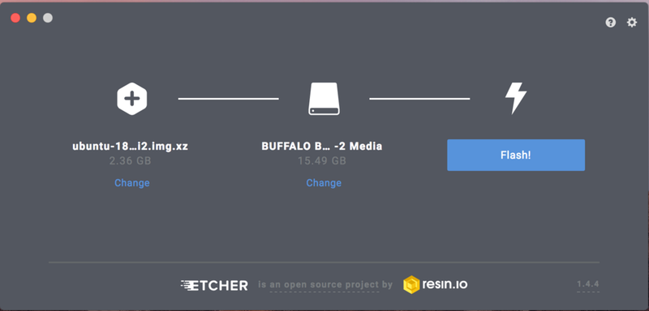

簡易的な説明のみになりますが, 動作させるまでの手順を書いておきます.   
※試す場合は自己責任でお願いします.   
## 用意するもの
* RaspberryPi 3B/3B+
* microSD

## イメージのダウンロード
以下のリンクから非公式版のUbuntu18.04をダウンロードします. 
(http://cdimage.ubuntu.com/ubuntu/releases/18.04/release/ubuntu-18.04.1-preinstalled-server-armhf+raspi2.img.xz)

## イメージの書き込み
microSDカードに任意の方法(ddコマンドなど)でイメージを書き込みます.   
自分はEtcherと呼ばれるアプリケーションで書き込みを行いました. 



これで, イメージの書き込みは終了です.   
しかし, このままでは動作しないので, 色々変更を加えます. 

変更には以下のサイトを参考にしました.   
(https://wiki.ubuntu.com/ARM/RaspberryPi)

### パーティションをマウント
Desktop版のUbuntuなどでmicroSDカードをマウントします.   
おそらく, 以下のパーティションがあると思います.   

* cloudimg-rootfs   
* system-boot

### config.txtを設定
system-bootパーティションの最上層にconfig.txtというファイルがあるので, 適当なエディタで編集します. 

※`device_tree_address`の部分はコメントアウトします. 

#### 変更前
```sh
kernel=uboot.bin
device_tree_address=0x02000000
```
#### 変更後
```sh
kernel=vmlinuz
initramfs initrd.img followkernel
#device_tree_address=0x02000000
```

## 2. 必要なファイルをコピー

system-bootではないもう一つのパーティション内の`/lib/firmware/4.15.0-1010-raspi2/device-tree`にある`bcm2710-rpi-3-b-plus.dtb`と`bcm2710-rpi-3-b.dtb`と`overlays`をsystem-bootパーティションの最上層にコピーします. 

`bcm2710-rpi-3-b.dtb`をコピーするのは, 後でRaspberryPi 3Bを使う為です. 

## 3. GPUのファームウェアとブートローダを更新する. 
公式Wikiに貼られているリンクは少し前のバーションのものなので, ここでは最新版をダウンロードします. 

wgetコマンドでファイルをダウンロードします. 
```sh
wget http://archive.raspberrypi.org/debian/pool/main/r/raspberrypi-firmware/raspberrypi-bootloader_1.20180619-1_armhf.deb
```

debファイルを展開します. 
```sh
dpkg-deb -x raspberrypi-bootloader_1.20180619-1_armhf.deb ~/Desktop/pi-bootloader
```
これで, デスクトップに`pi-bootloader`というフォルダが生成されたと思います. 
この`pi-bootloader`の`boot`フォルダの中身を`system-boot`パーティションの最上層に上書きコピーします. 

公式Wikiには, 上記の手順で起動すると表記されているのですが, 自分の環境ではうまく動作しませんでした. (Network Service表示されたまま進みません)

これは, `systemd-networkd-wait-online.service` というサービスが正常に動作していない(予想)ようで, このサービスを起動時に実行しないようにすれば, 3B+でも起動してくれるはずです. 
しかし, RaspberryPi 3B+ではそもそも起動しないので, 代わりにRaspberryPi 3BにmicroSDを挿入して起動して作業をすることにします. 

(microSDの中身を直接弄ってサービスの起動を止めようと思ったのですが, うまくいきませんでした...)

RaspberryPi 3Bで起動してログイン画面が表示されたら以下のIDとパスワードを打ってログインします. 
```
id: ubuntu
passwd: ubuntu
```

初回の起動時のみパスワードを設定しろというメッセージが出てくるので, 任意のパスワードを設定します. 

ログインが完了したら, 以下のコマンドを実行して, `systemd-networkd-wait-online.service`の自動起動を無効にします. 


```sh
systemctl disable systemd-networkd-wait-online.service
systemctl mask systemd-networkd-wait-online.service
```
このコマンドを実行すると何回かパスワードを聞いてくるのでパスワードを入力します. 

サービス自動起動の無効化ができたらシャットダウンします. 
microSDを抜いて, RaspberryPi 3B+にmicroSDを挿して起動させてみると, めでたく起動します！(動いてしまうのか...驚愕)

# 追加設定

ここからは, 追加で行う必要がある設定や, RaspberryPi 3B+でネットワーク接続に必要な設定などを書いていきます. 

## 初回起動時
初回起動のときに有線LAN接続してもDHCPがIPアドレスを振ってくれなかったので, 以下のコマンドを実行します. 
```sh
sudo dhclient eth0
```

`ip addr`などでIPが振られているのを確認したら, 次に進みます. 

## flash-kernel データベースの更新

現段階ではaptなどでパッケージをインストールしたりすると以下のようなエラーが出ます. 

```sh
Reading package lists... Done
Building dependency tree
Reading state information... Done
0 upgraded, 0 newly installed, 0 to remove and 0 not upgraded.
1 not fully installed or removed.
After this operation, 0 B of additional disk space will be used.
Setting up initramfs-tools (0.130ubuntu3.1) ...
update-initramfs: deferring update (trigger activated)
Processing triggers for initramfs-tools (0.130ubuntu3.1) ...
update-initramfs: Generating /boot/initrd.img-4.15.0-1013-raspi2
Unsupported platform.
run-parts: /etc/initramfs/post-update.d//flash-kernel exited with return code 1
dpkg: error processing package initramfs-tools (--configure):
 installed initramfs-tools package post-installation script subprocess returned error exit status 1
Errors were encountered while processing:
 initramfs-tools

E: Sub-process /usr/bin/dpkg returned an error code (1)
```
`Unsupported platform.`と出ています. 
これは, RaspberryPi 3B+モデルがflash Kernelのデータベースに登録されていないため, サポートされていないプラットフォームやでというメッセージです. 

そのため, 手動でデータベースに登録します. 

## モデル名を調べる
以下のようなコマンドを実行すると, 使っているデバイスのモデル名が出てきます. 
```sh
cat /proc/device-tree/model; echo
```
`Raspberry Pi 3 Model B Plus Rev 1.3`と表示されたと思います. 

このモデル名を使って, データベースに追記します. 
```sh
sudo vim /usr/share/flash-kernel/db/all.db
```

1429行目付近の部分に追記してください. 

```sh
# Raspberry Pi 3 Plus (BCM2710)
Machine: BCM2710
Machine: Raspberry Pi 3 Model B Plus Rev 1.3
DTB-Id: bcm2710-rpi-3-b-plus.dtb
U-Boot-Script-Name: bootscr.rpi3
Required-Packages: u-boot-tools
Boot-DTB-Path: /boot/firmware/bcm2710-rpi-3-b-plus.dtb
Boot-Kernel-Path: /boot/firmware/vmlinuz
Boot-Initrd-Path: /boot/firmware/initrd.img
Boot-Script-Path: /boot/firmware/boot.scr
# XXX we should copy the entire overlay dtbs dir too
```

これで再起動すると, aptなどでパッケージをインストールしても先程のエラーは表示されなくなります. 

## ifupdownコマンドのインストール 

再起動したので, 再びIPアドレスを取得します. 
```sh
sudo dhclient eth0
```

/etc/network/interfaceを設定します. 
以下のように追記します. 
```sh
auto lo
iface lo inet loopback

#------eth0----------
allow-hotplug eth0
iface eth0 inet dhcp
#--------------------
```

`ifupdown`コマンドをインストールします. 
```sh
sudo apt install ifupdown
```

これで毎回`sudo dhclient eth0`を実行しなくてもDHCPでIPが振られるようになったと思います. 

## 無線LANの設定

内蔵の無線LAN(wlan0)を使用する為には, 関連したファイルを更新する必要があります. 

```sh
mkdir wifi-firmware
cd wifi-firmware

wget https://github.com/RPi-Distro/firmware-nonfree/raw/master/brcm/brcmfmac43455-sdio.bin
wget https://github.com/RPi-Distro/firmware-nonfree/raw/master/brcm/brcmfmac43455-sdio.clm_blob
wget https://github.com/RPi-Distro/firmware-nonfree/raw/master/brcm/brcmfmac43455-sdio.txt 
sudo cp *sdio* /lib/firmware/brcm/
cd ..
```

これで再起動すると, wlan0(無線LAN)が動作するようになります. 

wlan0の設定は`/etc/network/interface`に書いていくのですが, 詳しい設定方法などは以下の記事にまとめてありますので, 参考にしてください. 

(http://www.asrobot.me/entry/2018/05/21/174208)

## 備考
* 固定IPアドレスを設定する際は, resolvconfのインストールが必要があるみたい. (DHCPの場合は要らなかった)
`sudo apt install resolvconf`
* ROS Melodicが動いた. 
* RaspberryPi Mouseのデバドラも動作した. 
* デバドラをcrontabで起動時に読み込むと, 変な音になった. 
* insmodするタイミングを遅くしたら治った. 

## 参考
(https://github.com/ev3dev/ev3dev/issues/606)

(https://wiki.ubuntu.com/ARM/RaspberryPi#Booting_the_official_Pi_2_image_on_the_Pi_3B.2F3B.2B-)

(http://takuya-1st.hatenablog.jp/entry/2017/12/19/211216)