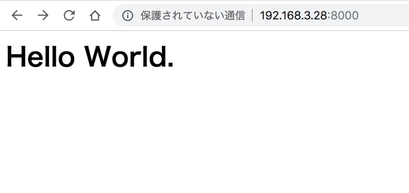

## はじめに
前々からPythonで簡易的にWebServerを立ち上げる機会が結構ありましたが, 記事に書いていなかったので今回まとめることにしました.内容はとても簡単なので, すぐ実行できると思います.

## 動作確認時の環境

* OS: Ubuntu 16.04
* Python2.7

## スクリプトの作成
適当なファイル名(`webserver.py`とか)でスクリプトファイルを作成してください.
```bash
touch webserver.py
```

## モジュールのインポート
```python
import SimpleHTTPServer, SocketServer, os
```
## ドキュメントディレクトリの指定
デフォルトだと今書いているPythonのスクリプトのディレクトリがドキュメントディレクトリになりますが, 都合が悪いときは別のディレクトリを指定できます.以下の場合は, `contents`というディレクトリを指定しています.
```python
os.chdir(os.path.join(os.path.dirname(__file__), 'contents'))
```

## サーバ部分
コード内の`8000`はポート番号なので必要があれば任意で変更してください.
```python
Handler = SimpleHTTPServer.SimpleHTTPRequestHandler
httpd = SocketServer.TCPServer(("", 8000), Handler)
httpd.serve_forever()
```

## index.htmlを作成
サーバは完成しましたが表示する内容がまだ無いので, `index.html`というファイルを作成します.
先程, `contents`というフォルダをドキュメントディレクトリに指定したので以下のような階層でファイルを配置します.

* webserver.py
* contents
    * index.html

```bash
mkdir contents
cd contents && touch index.html
```

ファイルが作成できたら, index.htmlを以下のように編集します.
```html
<h1>Hello World.</h1>
```

## 実行
```bash
python webserver.py
```
サーバが立ち上がったので, ブラウザからアクセスしてみます.
```
http://localhost:8000/
```


これでPythonで簡単にWebServerを立ち上げることができました.
もし動かない場合はコメントなどで教えてください！

## 今回のソースコード
```python
#!/usr/bin/env python
import SimpleHTTPServer, SocketServer, os

os.chdir(os.path.join(os.path.dirname(__file__), 'contents'))
Handler = SimpleHTTPServer.SimpleHTTPRequestHandler
httpd = SocketServer.TCPServer(("", 8000), Handler)
httpd.serve_forever()
```