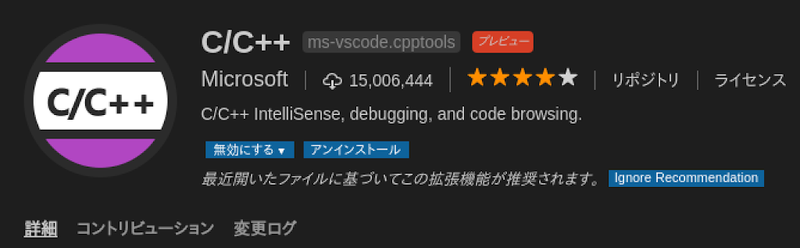
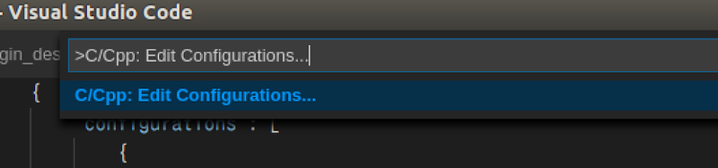

## はじめに
VSCodeには, 拡張機能を追加することで, C++での開発が圧倒的に早くなります.
特にintellisense機能が優秀でクラス, 関数, 変数が気持ち良いぐらいに補完されます.
しかし, ROS関連の補完は, デフォルトの設定だとパスが通っていないので, 追加で設定しないと補完が効きません.
そこで, ROS関連の補完を効かせるまでの流れについて説明をしていきます.

## 環境
* Ubuntu Desktop 16.04
* ROS Kinetic

## 拡張機能のインストール
まず, 拡張機能の検索画面で`C++`と検索すると以下の拡張機能が見つかると思います.
これは, C++/Cの補完を強化する拡張機能ですので、インストールします.



## インクルードパスを設定
Control + Shift + Pでコマンド画面を出して`C/Cpp: Edit`と検索して, `C/Cpp: Edit Configurations...`を実行します.



そうすると, `c_cpp_properties.json`というファイルが開くので以下のように編集します.
```json
{
    "configurations": [
        {
            "browse": {
                "databaseFilename": "",
                "limitSymbolsToIncludedHeaders": true
            },
            "includePath": [
                "/home/atsushi/catkin_ws/devel/include/**",
                "/opt/ros/melodic/include/**",
                "/usr/include/**"
            ],
            "name": "ROS",
            "intelliSenseMode": "gcc-x64",
            "compilerPath": "/usr/bin/gcc",
            "cStandard": "c11",
            "cppStandard": "c++17"
        }
    ],
    "version": 4
}
```
※ `/home/atsushi`の部分は適宜自分の環境に合わせて変更してください。

自分の環境では, この設定で補完が効くようになりました.
もし動かない場合には, コメントを頂けると助かります.