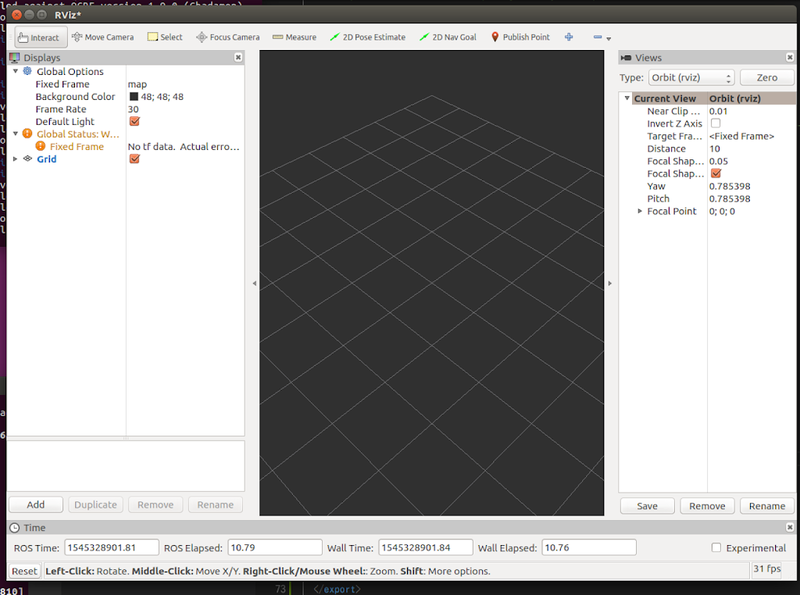
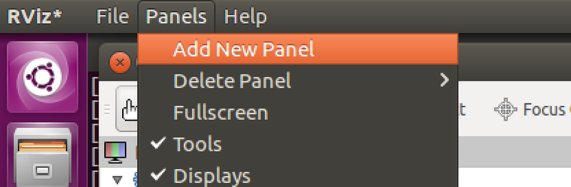
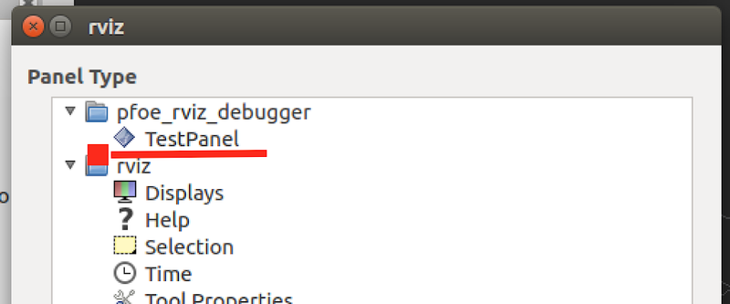
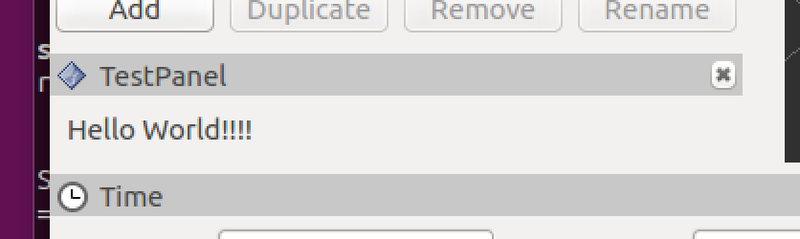

## はじめに
Rvizには、`image_view`のように、ウィンドウにパネルを追加する機能が標準で備わっています。
今回は、このパネルを開発する手順について説明したいと思います。

## 環境
* Ubuntu Desktop 16.04
* ROS Kinetic

## とりあえず動かしてみる
最初から複雑なパネルを作成してもよいですが、一番最初はパネルに`Hello World`を表示させてみましょう。
これで基本的な部分について理解していきます。

### パッケージの作成
今回は、`rviz_test_panel`という名前のパッケージを作成します。
```bash
catkin_create_pkg rviz_test_panel std_msgs roscpp
```

### TestPanel.h
```cpp
#ifndef Q_MOC_RUN
    #include <ros/ros.h>
    #include <rviz/panel.h>
#endif

class TestPanel: public rviz::Panel {
Q_OBJECT //継承時に必要なマクロ
public:
    TestPanel(QWidget* Parent = 0); //コンストラクタ
};
```

### TestPanel.cpp

```cpp
#include <stdio.h>
#include <ros/ros.h>
#include <QLabel>
#include <QVBoxLayout>
#include "TestPanel.h"

TestPanel::TestPanel(QWidget* parent)
    :rviz::Panel(parent) //初期化
{
    QVBoxLayout* layout = new QVBoxLayout; //ボックスレイアウト
    QLabel* label = new QLabel("Hello World!"); //ラベルオブジェクトを作成
    layout->addWidget(label);
    setLayout(layout);
}

#include <pluginlib/class_list_macros.h>
PLUGINLIB_EXPORT_CLASS(TestPanel, rviz::Panel)
```

### CMakelists.txt
```cmake
find_package(catkin REQUIRED COMPONENTS
  roscpp
  rospy
  std_msgs
  rviz
)

set(CMAKE_AUTOMOC ON)
find_package(Qt5 ${rviz_QT_VERSION} EXACT REQUIRED
  Core
  Widgets
)

set(QT_LIBRARIES Qt5::Widgets)
add_definitions(-DQT_NO_KEYWORDS)

add_library(${PROJECT_NAME}
  src/TestPanel.cpp
)

target_link_libraries(${PROJECT_NAME}
  ${catkin_LIBRARIES}
  ${QT_LIBRARIES}
)
```

### plugin_description.xml
`lib/librviz_test_panel`の部分は、lib/lib + パッケージ名にします。
```xml
<library path="lib/librviz_test_panel">
  <class type="TestPanel" base_class_type="rviz::Panel">
    <description>TestPanel</description>
  </class>
</library>
```
### package.xml
```xml
<package>
  <!-- 色々書いてある -->
  
  <build_depend>qtbase5-dev</build_depend>
  <build_depend>rviz</build_depend>

  <exec_depend>libqt5-core</exec_depend>
  <exec_depend>libqt5-gui</exec_depend>
  <exec_depend>libqt5-widgets</exec_depend>
  <exec_depend>rviz</exec_depend>

  <export>
    <rviz plugin="${prefix}/plugin_description.xml"/><!-- 追加 -->
  </export>
</package>
```

### catkin_make
```sh
cd ~/catkin_ws && catkin_make
```

## パネルの動作確認
rvizを起動します。



メニューから`Add New Panel`を選択します。



TestPanelを選択します。



選択すると、以下のように小さいパネルが追加され、`Hello World!`が表示されます。



簡単なものですが、自作のパネルを作成することができました。
次回は、このパネルをベースに様々な機能を追加していきたいと思います。